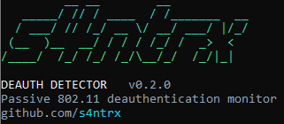

# deauth-detector

Passive 802.11 deauthentication attack detector. It listens on a monitor-mode interface (or replays a pcap), groups suspicious frames into incidents, fingerprints spoofed frames, tracks which clients are hit, and writes a forensic log you can turn into a timeline.

It never transmits. There is no injection code in this repository.


## Interface

Running `deauth-detector` with no arguments prints the banner and help:

<p align="center">
  
</p>

- Alerts render as severity-colored panels. Rule names come with a plain-language explanation and concrete next steps.
- `monitor` shows a live dashboard (status, deauth rate, frames seen, uptime, last alert) above the alert stream.
- `analyze` ends with a verdict, an incident table, affected clients, and next steps.
- `timeline` shows each incident with reason codes, event history, and an activity chart.
- Piped or redirected output falls back to one plain line per alert, so logs stay grep-friendly. `--no-banner` hides the banner and the `NO_COLOR` environment variable disables color.

## Vendor lookup

Every MAC address in an alert is resolved to the organization that registered its first three bytes (OUI), for example `14:18:77` resolves to Dell Inc. Lookups use the manufacturer database bundled with scapy, so there is no extra dependency and no network access.

```bash
deauth-detector vendor 14:18:77:aa:bb:cc 3c:22:fb:00:00:01
```

How to read the result:

- `locally administered` means the address has the local bit set. Phones use this for privacy MACs, and routers use it for guest-SSID virtual interfaces. There is no vendor to find. For access points the tool shows a likely base vendor, marked as a virtual interface.
- The vendor of a source address in a forged frame is the vendor of the device being impersonated, not the attacker's. Do not use it to identify the attacker.
- The database is as current as your scapy release. Newly registered prefixes show as `Unknown vendor` until you run `pip install -U scapy`.

## How detection works

Every deauthentication and disassociation frame is logged. An incident opens only when a rule fires, so one stray frame never alerts.

| Rule | Fires when | Severity |
| --- | --- | --- |
| `flood` | frames per BSSID in the window reach `warning_frames` / `critical_frames` | WARNING / CRITICAL |
| `client_repeat` | one client is targeted `client_repeat_frames` times in the window | WARNING |
| `multi_source` | `multi_source_min` distinct source MACs target one client | WARNING |
| `foreign_source` | frame claims the AP's BSSID but is sent by neither the AP nor the client | spoof flag |
| `rssi_mismatch` | frame claims to be from the AP but its signal differs from the AP's beacon baseline by `rssi_deviation_db` | spoof flag |
| `sequence_anomaly` | frame claims to be from the AP but its sequence number is far from the AP's latest beacon | spoof flag |
| `pmf_violation` | AP requires protected management frames but the deauth is unprotected | spoof flag |
| `suspicious_reason` | supporting evidence only: reason code in `suspicious_reasons` while another rule is active | none |

Spoof flags need `spoof_min_frames` flagged frames inside the window before they count. A spoof flag plus a flood escalates to CRITICAL.

Alerting is graduated: single frame is log only, a pattern opens a WARNING incident, a severe or spoofed flood escalates to CRITICAL. One incident per BSSID emits at most three alerts: opened, escalated, closed.

## Install

```bash
git clone https://github.com/s4ntrx/deauth-detector.git
cd deauth-detector
python3 -m venv .venv
.venv/bin/activate
pip install -e ".[dev]"
```

Requires Python 3.11+. Live capture needs Linux, root, and an adapter that supports monitor mode.

## Usage

Replay a capture (no root needed):

```bash
python scripts/make_sample_pcap.py
deauth-detector analyze examples/sample_attack.pcap --log events.jsonl
deauth-detector timeline events.jsonl
```

The log is append-only and every run is tagged with a run ID, so reusing one log file keeps runs separate in the timeline.

Live monitoring:

```bash
sudo scripts/monitor_mode.sh up wlan1
sudo .venv/bin/deauth-detector monitor -i wlan1 --channel 6 --log events.jsonl
sudo .venv/bin/deauth-detector monitor -i wlan1 --hop --known-ap aa:bb:cc:dd:ee:ff
sudo scripts/monitor_mode.sh down wlan1
```

Options shared by `monitor` and `analyze`:

| Option | Purpose |
| --- | --- |
| `--config FILE` | TOML thresholds, see `examples/config.example.toml` |
| `--known-ap BSSID` | monitor only your own APs; repeatable |
| `--log FILE` | append every deauth, counted reconnect, and alert as JSONL |
| `--webhook URL` | POST each alert as JSON |
| `--no-banner` | skip the banner |
| `--fail-on warning\|critical` | `analyze` only; exit 1 when an incident reaches that severity, for CI use |

Sample alert from the bundled capture:

```
╭─  CRITICAL  Attack escalated  #1  ──────────────────────────────────────────╮
│                                                                             │
│  Access point  24:5a:4c:00:00:01  LabNet  Ubiquiti Inc  channel 6           │
│  Evidence      client_repeat  the same client keeps getting disconnected    │
│                flood  frame rate against this access point is far above     │
│                rssi_mismatch  signal strength differs from the real AP's    │
│                sequence_anomaly  sequence numbers do not follow the real AP │
│  Volume        10 frames   2 clients   9 spoof-flagged   peak 10 per window │
│  Targets       3c:22:fb:00:00:01  Apple, Inc.  x5                           │
│                14:18:77:aa:bb:02  Dell Inc.  x5                             │
│  Transmitter   mean signal -25.0 dBm, roughly 0.3 m away (single sensor)    │
│  Next steps    - Frames look forged, not sent by your AP.                   │
│                - Enable PMF (802.11w) on this AP. WPA3 requires it.         │
╰───────────────────────────────────────────────────────────── 2025-10-09 ───╯
```

## Limitations

- One radio sees one channel at a time. `--hop` trades coverage for dwell time, so short attacks on other channels can be missed. Use one adapter per monitored channel for real coverage.
- The spoof fingerprints are heuristics. RSSI shifts with movement and multipath, and sequence numbers depend on how the attacker's driver injects frames. Treat flags as evidence, not proof.
- Distance in `attacker_estimate` comes from a log-distance path-loss model and a single sensor. It is an order-of-magnitude hint. Locating a transmitter requires at least three synchronized sensors.
- With PMF (802.11w) in force, spoofed deauths are ignored by clients, but the detector still reports them. Detection does not prevent anything.
- Learning APs from beacons trusts whatever beacons it hears. Pass `--known-ap` so an evil twin cannot define your baseline.
- Vendor names identify hardware, not people or intent, and randomized addresses carry no vendor at all.
- Reconnect tracking sees authentication and association requests only on the channel being monitored.

## Design decisions

- WPA2 decryption is intentionally absent. Deauthentication frames are unprotected management frames unless PMF is negotiated, so there is nothing to decrypt, and with PMF they are encrypted in a way a passive sensor cannot read. The outline's decryption step adds complexity and no detection value.
- The outline lists reason 7 as "class 2 frame from a non-authenticated entity". Per IEEE 802.11 that is reason 6; reason 7 is class 3 frame from a non-associated station. `models.REASON_NAMES` follows the standard.
- Reason codes 2 and 7 are supporting evidence only. Attack tools can emit any code, and legitimate APs emit them too.
- Disassociation frames are handled like deauth frames because they cause the same disconnects.


```

## Development

```bash
pytest
```

Tests build frames with scapy and write them to temporary files. Nothing is transmitted.

## Legal

Only monitor networks you own or have written permission to assess. Passive capture of other people's wireless traffic is regulated or illegal in many jurisdictions.

